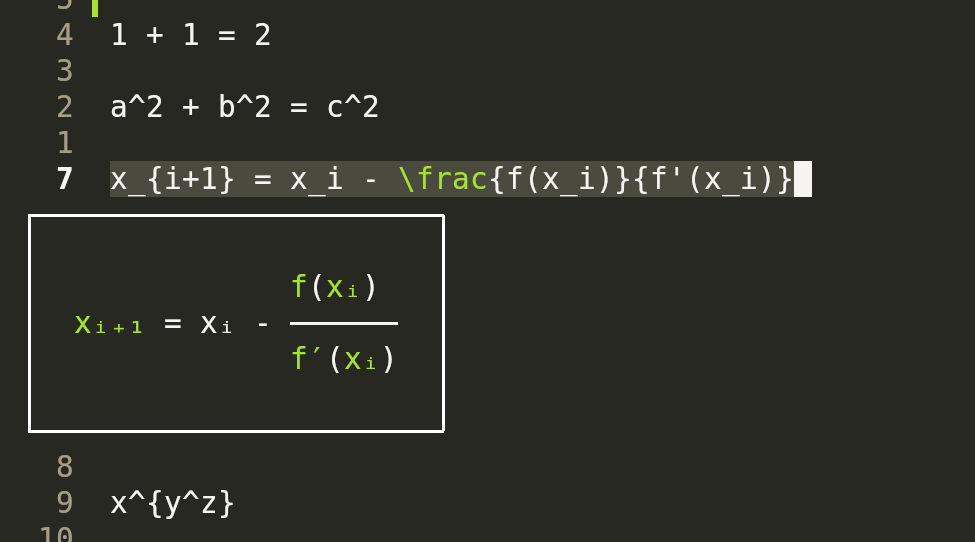

# HeTeX: Helix LaTeX preview

This plugin relies on [libtexprintf](https://github.com/bartp5/libtexprintf/) providing utftex which is a great program converting small latex expressions into ascii.

This plugin uses this as an embedded binary by echoing the output to create a popup. It's a pretty crude approach but it does render the text. I'd like to switch over to the components at some point but at this point they are very verbose (and difficult to write!) and I'm not positive the api will stay the same. If someone wants to merge a patch it'd be very welcome.

I'm also not sure about the saftey of echoing the output, it seems possible to break out of the containment which I don't like, however since the input is passed to utftex first, you'd need to get utftex to output a dangerous string which I haven't been able to do, either way, exercise mild caution.

Also I'm on Linux and have not been able to test on other platforms. I think that some antiviruses may take objection to running a binary in a temp directory so if someone could test windows compatability I'd appreciate it. *This may not run on Windows*.



## Installation

This is a helix plugin made using steel. To install, you can use the `forge` command line tool,
which also requires having a rust toolchain installed. In addition, there are a few dependencies for libtexprintf 

```
C toolchain
autoconf
automake
make
pkg-config
m4
libtool
```

You can either clone the repo and then from the root run:

`forge install`

Or you can (assuming you have the dependencies installed) do:

`forge pkg install --git https://github.com/daynardn/HeTeX.hx.git`.


This will build and install the library.

You should then be able to use the library like so:

```steel
(require "hetex/hetex.scm")
```

To run the parser on the current selection

```txt
:hetex-run
```

or

```scheme
(hetex-run)
```

## Contribution

Any contribtuions are welcome. There's a few things I want to target but I currently cannot, if anyone wants to work on them, feel free.
* Popup creation via the component system and (new-component!) function. I tried but it was so many things to implement.
* * As a note, some of the time the boxes are created lopsided, there is very crude logic to attempt to fix this, but a native implementation would avoid this
* Autorendering whenever the cursor moves between "\$" ... "\$" ranges. This shouldn't be hard but there are multiple supported deliminators 
* * This probably should be switched to a nonblocking method first to avoid lagging the editor
* * This also should be gated by some sort of configuration to disable it.  
* On Helix start writing the libtexprintf binary to the temp file rather than on every invocation (yeah). I couldn't find an "OnHelixStart" and I don't want it to be something you have to enable
* There are a couple of upstream issues (I think) documented in [tests.tex](tests.tex). If someone wants to take a look and confirm they could send a patch upstream to libtexprintf. 
* cog.scm has "dependencies", which might be able to bring in the c dependencies at some point?

## Credits

I wrote this plugin but there's a few things that helped

I used this as a base for writing the plugin
* [helix-file-watcher](https://github.com/mattwparas/helix-file-watcher)

Really hard to find program that helped a ton
* [libtexprintf](https://github.com/bartp5/libtexprintf/)

This is the vim plugin I got the idea from. Initally I tried to convert this but it was too many lines
* [nabla.nvim](https://github.com/jbyuki/nabla.nvim) 

Also, all of this is only possible due to the hard work of mattwparas. Thank you!